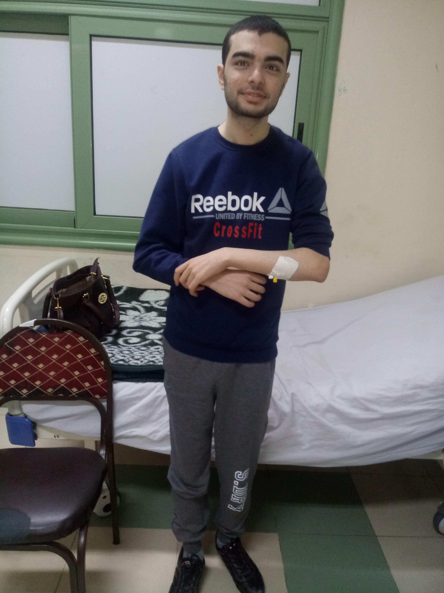

The day is Sunday, <mark>July 20 2014</mark>, I feel very worried leaving home to see a Neurologist, that is a really horrific situation, I just finished general secondary exams, I should be celebrating!

It was a relieving visit anyway, talking about my very brief medical history, doing a typical neurological exam. Checking the lonely MRI, Reassuring the anxious-faced me, the doctor said everything will be fine and started talking about the medication plan, <mark>A 5 day pulse IV corticosteroids followed by 12 days of oral steroids</mark>, To me that meant one thing: <em>The holiday season is over</em>!

The next day I was admitted at the hospital for a week to have the weird IV infusions, The first day was heavy on me but next days quickly passed, Everything went as planned except that I didn't feel much difference, I could hardly walk without aid! but I was home and tomorrow is Eid Al-fitr, taking the oral tabs is much easier, That was relieving, But I even felt worse than before because of the very hot weather, Temp was 40+ centigrade, <em>It was the dog days of summer!</em>

On Sunday, Aug 3 I see the doctor again, I learned that <mark>high temps cause MS symptoms to exaggerate!</mark> The doctor extended oral solupred for 20 more days after seeing that I didn't get much better, later on solupred I slowly recover most motor abilities but fine ones took the hit and never came back.

I could say it took me more than 2 months of Solupred to be able to walk without any assistance, carefully but confidently, slow and steady.

### Here's a brief list of next doctor visits and Meds:

 

- <mark>Aug 24</mark>: 12 more days of Solupred

- <mark>Oct 27</mark>: 5 1gm <mark>IV Solumedrol</mark> followed by 20 days of Solupred, discussed starting Betaferon
<!-- - <mark>Nov 30</mark>: Nothing New! -->
- <mark>Jan 31 2015</mark>: I started taking <mark>Betaferon</mark> , a SC injection for 3 days a week

- <mark>Mar 31</mark>: Continue on Betaferon, to start Fampyra, next appointment Oct 3

- <mark>Sept 7</mark>: Solumedrol 5 days then Solupred 12 days, disscussed stopping betaferon & starting gilenya, Oct 7 started Fampyra 2 Tabs a day for 5 weeks then stoppet it.

- <mark>Jan 27 2016</mark>: Jan 1 Last Betafron injection, On Jan 13 <mark>VZV IgG was negative</mark>, to start gilenya after VZV vaccination

- <mark>Apr 3</mark>: Finally started <mark>Gilenya</mark>

I continued on Gilenya for 2.5 years, Never got any new symptoms but slowly getting worse, never restoring any functions,
Later on I became <mark>wheelchair</mark> seated but not bound, just for easier mobilety

### KAMSU

 

- <mark>Oct 24 2018</mark>: Stopped Gilenya, to start Endoxan after 2 months washout, IV Solumedrol in between

- <mark>Dec 30 2018</mark>: 5 days IV Solumedrol then 1gm Endoxan, Epic failure to follow Endoxan induction regimen, At MUH BTW ;D

- <mark>Feb 6</mark>: 5 days 1gm <mark>Endoxan induction</mark> then 1gm/month for 5 months

- <mark>July 14</mark>: 3 month Endoxan washout before starting <mark>MabThera</mark>

<h5>Comments on journey</h5>

At first I thought I have <abbr title="Relapsing Remitting MS">RRMS</abbr>, but later I believe it was either an aggressive RRMS that quickly transitioned to <abbr title="Secondary Progressive MS">SPMS</abbr> in less than a year, or it was <abbr title="Primary Progressive MS">PPMS</abbr> since the beginning...

I couldn't Distinguish a relapse, it alwayse was a slow progression that partially resets after pulse steroids from the very beginning...

I always heared how magical IV steroids is for MS patients, but for me it wasn't that effective...

At first, I couldn't tell which side of my body is weaker, later the right side started to get weaker than the other and is still so...

Betaferon only gave me the flu-like side effects...

Fampyra didn't work at all...

I took nothing for 4 months before starting Gilenya!

During Endoxan induction, I could stand for a few seconds without assistance... !

Since March 2019, I could walk 5+ meters without aid, though not reliable & abnormal gait and very slow foot walk but I feel vastly improved and so grateful!
<iframe width="560" height="315" src="https://www.youtube.com/embed/z7BF1uOOrHI" frameborder="0" allow="accelerometer; autoplay; encrypted-media; gyroscope; picture-in-picture" allowfullscreen></iframe>

<i>To Be Continued..,</i>